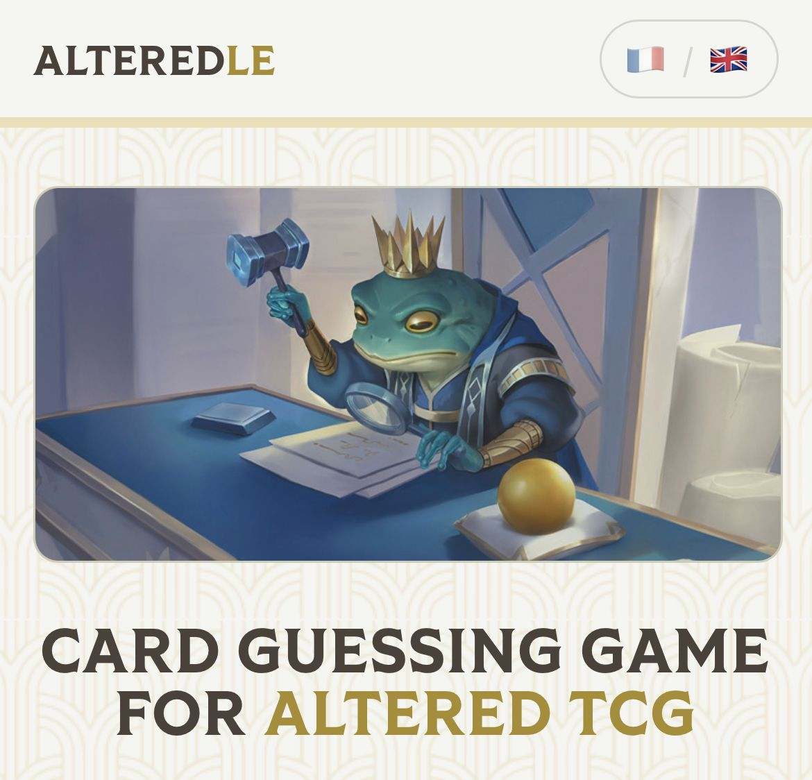
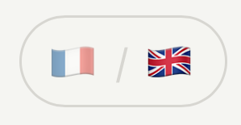
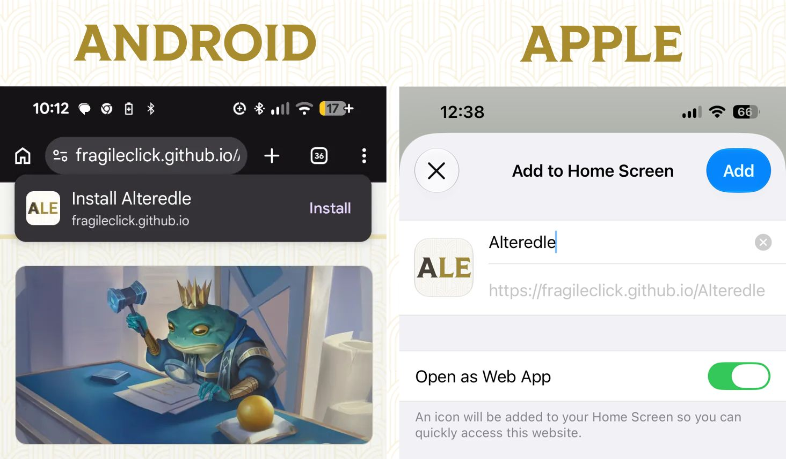
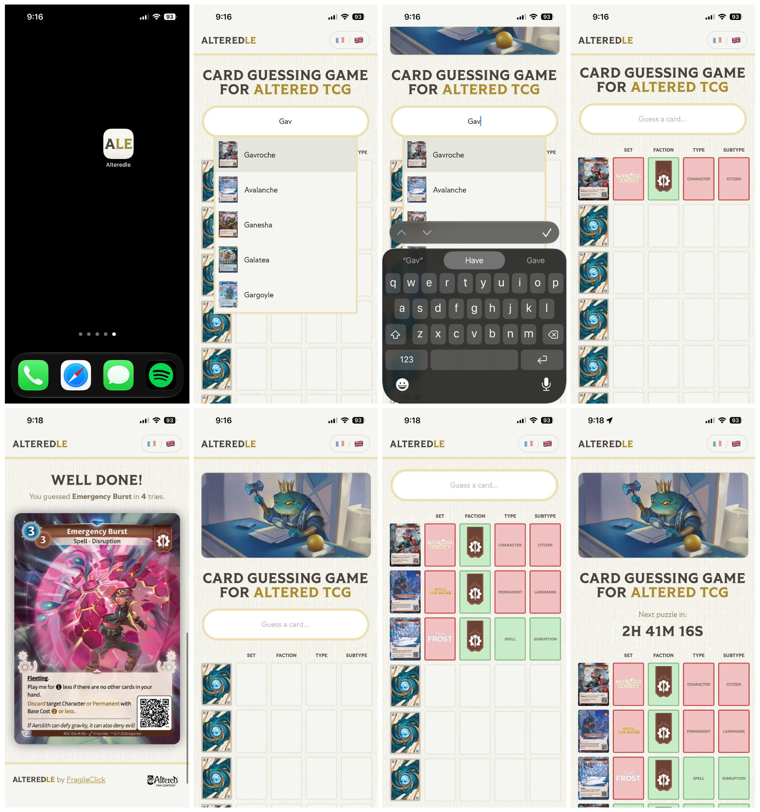

    

**Alteredle** is a card guessing game for [Altered TCG](https://www.altered.gg/en-us). The game is inspired by the popular word-guessing game [Wordle](https://www.nytimes.com/games/wordle) and the many variations like [Pokedle](https://www.pokedle.net/), [Runedle](https://runedle.com/#/runes), and more.

<h3 align="center" style="font-size:2em"><a href="https://fragileclick.github.io/Alteredle">Click to play Alteredle</a></h3>

<a href="https://fragileclick.github.io/Alteredle">https://fragileclick.github.io/Alteredle</a>

    

## Card List

The card list contains cards from sets 1-6. The card list only includes the standard printings; not Alt-Art, Promo, Serialized, Stamped, etc. For cards that were re-printed in multiple sets (ie. some Heroes) the list only include the earliest printing of each card.

| Set                          | Included | # Cards |
|------------------------------|----------|---------|
| Beyond The Gates (BTG)       | 🟢 Yes   | 180     |
| Trial By Frost (TBF)         | 🟢 Yes   | 91      |
| Whispers From The Maze (WFM) | 🟢 Yes   | 91      |
| Skybound Odyssey (SKY)       | 🟢 Yes   | 108     |
| Seeds Of Unity (SDU)         | 🟢 Yes   | 105     |
| Roots Of Corruption (ROC)    | 🟢 Yes   | 105     |
| Neverending Journey (NEJ)    | 🔴 No    | 0       |

The card list includes in-faction Rare, Hero and Exalted cards. The card list does not include out-of-faction Rare, Common, Uniques or Token cards.

| Rarity           | Included |
|------------------|----------|
| Common (C)       | 🔴 No    |
| Rare (R)         | 🟢 Yes   |
| Faction Rare (F) | 🔴 No    |
| Hero (H)         | 🟢 Yes   |
| Token (T)        | 🔴 No    |
| Unique (U)       | 🔴 No    |
| Exalted (E)      | 🟢 Yes   |

The card data and images come from the [AlteredCore](https://alteredcore.org) API and CDN. The script [`gen-card-db.py`](scripts/gen-card-db.py) requests card data from the API and formats it into into the cards object in [`db.js`](js/db.js).

| Data        | Source                                                 |
|-------------|--------------------------------------------------------|
| Card Data   | [cards.alteredcore.org](https://cards.alteredcore.org) |
| Card Images | [cdn.alteredcore.org](https://cdn.alteredcore.org/)    |

<!-- ## Language

Alteredle supports English and French.

 -->

## Install

Play [Alteredle](https://fragileclick.github.io/Alteredle) in your browser or add-to-homescreen to run as a Progressive Web App (PWA).

## Screenshots

## Disclaimer

Alteredle is an unofficial fan game and is not affiliated with Equinox.

